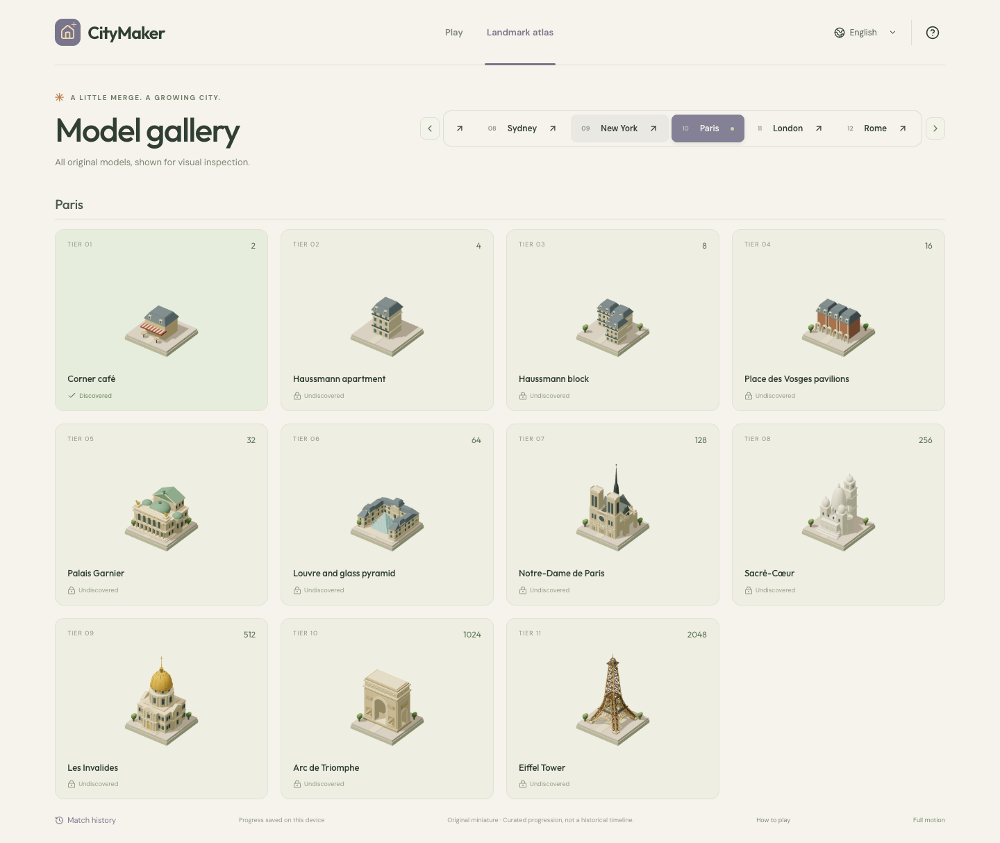
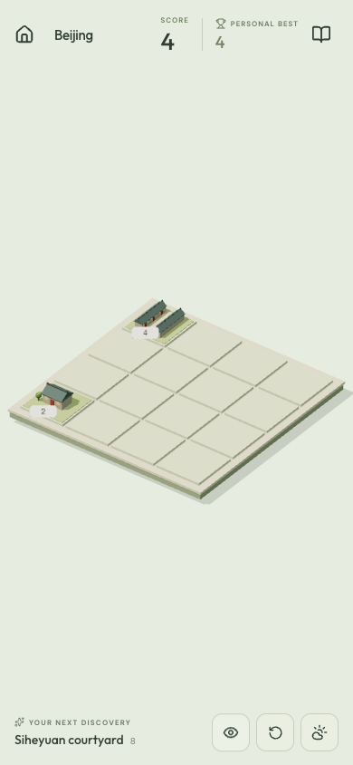
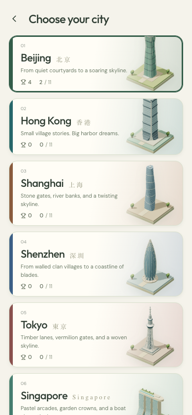

# CityMaker

<p align="center">
  <a href="https://citymaker.0to1app.com">Play online</a> ·
  <a href="README.zh-CN.md">简体中文</a>
</p>

A browser-based 2048 puzzle made from original, procedural Three.js architecture. Build twelve cities from traditional homes to modern landmarks: Beijing, Hong Kong, Shanghai, Shenzhen, Tokyo, Singapore, Dubai, Sydney, New York, Paris, London, and Rome. Each city has eleven tiers, for 132 original models, with independent saves and English, Simplified Chinese, and Traditional Chinese text. No account or backend is required.

<p align="center">
  <a href="https://citymaker.0to1app.com">
    
  </a>
</p>

## Screenshots

The landmark atlas presents every city's progression from vernacular architecture to a recognizable skyline. The interface also adapts into a focused mobile layout for play and city switching.

<p align="center">
  
</p>

<p align="center">
  
  &nbsp;&nbsp;
  
</p>

## Run locally

Requires Node.js 22.12+ (tested on 22.19).

```sh
npm install
npm run dev
```

Open the localhost URL printed by Vite. `npm run build` creates a static site in `dist/`; `npm run preview` serves the production build locally. Nothing is deployed automatically.

```sh
npm run typecheck
npm test
npx playwright install chromium
npm run test:e2e
```

## Play

- A 4×4 board starts with two homes. Slide all tiles using arrow keys, WASD, the four on-screen diagonal arrows, or a diagonal touch swipe.
- The isometric board projects **left as ↖**, **up as ↗**, **down as ↙**, and **right as ↘**. Touch follows these screen diagonals; keyboard arrows use the corresponding logical board axes.
- Equal buildings merge once per move. Each valid move spawns a 2 (90%) or 4 (10%) on a uniformly selected empty cell. Invalid moves do not spawn anything.
- Scores add the values of merged buildings. Reaching 2048 wins and completes that run; a board without legal moves loses.
- Undo restores the immediately preceding board and score once. Discoveries and personal bests are retained. A subsequent valid move enables undo again.
- Switching cities preserves each city's run. Restart asks for confirmation and preserves collection and best score. The city rail scrolls horizontally; arrow keys and Home/End move between cities without moving the board.
- The atlas previews all eleven buildings of the selected city, marks discoveries, and supports dragging or arrow-key rotation in the detail viewer. Previews do not unlock buildings.
- English, Simplified Chinese, and Traditional Chinese are available. Reduced motion follows the OS by default and can be changed for the current visit.
- A weather button in the board toolbar cycles clear → cloudy → rain → snow → fog → off. Weather changes automatically every 45–90 seconds unless off; web transitions blend over three seconds. Weather dims or brightens the scene lighting, tints the CSS sky to match, and stays remembered per browser. Reduce motion freezes weather on a static frame; the model viewer and thumbnails never show weather.

Progress now uses the `citymaker` IndexedDB database (schema version 1). The `progress` store holds the current per-city save and migration marker; the `battles` store holds independently keyed sessions with city/date indexes. On first use the old `citymaker:v1` localStorage value is migrated in one transaction and kept untouched as a backup. Later loads prefer IndexedDB and never re-import a stale legacy backup. The game waits for loading to finish before accepting input, and displays saving/saved/failure state based on transaction completion.

Open **Match history** in the footer to see completed and restarted runs with city, score, highest tier, effective moves, and start/end timestamps. Results are keyed by session: undoing a finish returns the record to in-progress, and finishing again updates that record. Restart archives a played run once; untouched boards are omitted. City switching does not end a run. Progress and battle updates commit atomically and rapid saves are serialized. Old historical matches cannot be reconstructed from the legacy save; session time and move counting start when that save is migrated.

The save payload remains version 1 with additive session metadata, including the optional `showLabels` and `weather` (`clear`/`cloudy`/`rain`/`snow`/`fog`/`off`; absent means clear) preferences. Invalid city saves are discarded independently; unavailable IndexedDB allows temporary play with a visible notice. Saves do not synchronize between devices. The initial font request uses Google Fonts; local system fonts are the fallback. App installation and guaranteed offline caching are outside this release.

## Add a city

The engine knows tile values, not city names or model shapes. A city has one small metadata module, one building-data module per tier, and one model-factory module per tier.

1. Create `src/cities/<id>.ts` exporting a `CityPack` with a unique stable `id`, country grouping, `nativeName`, English/Simplified/Traditional city names and descriptions, and a four-color palette. Put each tier in its own `src/cities/<id>/buildings/<model-key>.ts` file using the `b()` helper from `../../authoring`; each building needs a stable model key and at least one primary architectural reference URL. Import the eleven modules into `src/cities/<id>/buildings/index.ts` in 2–2048 order, then **append** the city to the `cities` array in `src/cities/packs.ts`.
2. Create the matching `src/scene/models/<id>/<model-key>.ts` module exporting a single `Factory`, then register it in the small `src/scene/models/<id>.ts` city aggregator, which is spread into `modelFactories` in `src/scene/models.ts`. Reuse the `ModelKit` roof, house, tree, window, primitive, and beam functions from `src/scene/kit.ts`; helpers shared by more than one city live in `src/scene/parts.ts` and `src/scene/architecture.ts`, and city-specific helpers live in `src/scene/models/<id>/shared.ts`.
3. A factory receives `(kit, group, city)` and adds architecture with its ground at **y=0**, inside **x/z ±0.8**, with maximum height **2.65**. `createBuilding` supplies landscaping and the standardized plot, so do not draw your own ground. Custom geometry must be acquired through `kit.geometry(key, factory)` so it is shared and disposed with its rendering context. Bespoke cache keys must be prefixed with the model key; the shape-derived keys that `kit.roof` and `kit.cylinder` generate are meant to be shared across cities.
4. **Model keys are globally unique** and every key in a city shares that city's prefix — `validatePacks` enforces both. Previews and gallery React keys use `cityId + ":" + model`; building templates also include the owning city in their cache key.
5. Open `/?gallery` to inspect all models. Previews are cached per city and model, rendered for the active city on load and backfilled for the rest during idle time, so give the gallery a moment to fill before judging it. Run the model bounds, uniqueness, and pack validation tests, then inspect mixed-height boards at 360px and 390px.

Array order is public API: the chapter number, the two-digit rail badge, and the default city for a new player all derive from array position. Insert a city and you silently renumber the existing ones. `validatePacks` checks identities, all tiers, registered factories, localization completeness, and reference URLs — but only that a URL starts with `https://`, so check liveness by hand before merging. Never repurpose, rename, or remove a shipped city ID or tier/model meaning without a save migration; an id that disappears from the roster is dropped from the save on the next write. Version 1 ignores future unsupported save versions rather than attempting to interpret their contents.

City data and model factories are all statically imported, because the id list, every localized city name, and `validatePacks` are needed before the first paint. Only `modelFactories` is genuinely deferrable, and `createBuilding` looks it up synchronously. The twelve-city index chunk is 349.59 kB raw, below the 350 kB splitting threshold. Including Three.js, initial JavaScript totals 864.46 kB raw / 254.11 kB gzip; moving content between static chunks would not reduce that total. Measured timings and memory are recorded in QA.md.

## Code layout

- `src/game/engine.ts`: immutable merge rules, injected randomness, status, undo, and movement events.
- `src/game/storage.ts`: save parsing, validation, per-city records, and legacy migration decoding.
- `src/game/repository.ts`: platform-neutral storage interface and IndexedDB implementation for progress and history.
- `src/cities/`: typed pack interface, the `b()`/`localized()` authoring helpers, `validate.ts`, one metadata module plus an individual data file per building, and `packs.ts` as the city aggregator.
- `src/scene/`: `kit.ts` (the `ModelKit` toolkit and `Factory` type), `parts.ts` (helpers shared between cities), one model file per building under `models/<city>/`, small city aggregators, the `models.ts` factory registry, scene resource ownership, animation, canvas and pointer interaction.
- `src/App.tsx`, `src/i18n.ts`, `src/styles.css`: accessible HTML interface, translations, responsive layout.
- `tests/`: engine, persistence, model contracts, and browser interaction tests.

The renderer uses one active board context plus a temporary thumbnail context and, when open, one model viewer. Building previews are rendered for the active city when it loads and backfilled one city per idle slice; the offscreen context is created and disposed per slice rather than held, and each preview is cached for the page session under its city and model. Rendering is on demand, stops when hidden, and runs continuously during the 310 ms move animation and — in the board view only — while a weather effect (clouds, rain, snow, fog, or a transition) is active, throttled to roughly 30 fps and disabled entirely by Reduce motion, which draws one static weather frame. Device pixel ratio is capped at 2. Static building parts are batched by material and cached as reusable templates, keeping each landmark to a small number of draw calls. Geometries and materials are shared within a context and disposed on teardown.

## Original art and references

All 132 miniatures are authored as procedural geometry in this repository. No TokyoMaker graphics, third-party building meshes, or textures are used. Landmark proportions are deliberately compressed for gameplay; the sequence is a curated visual progression, not a historical timeline. Sources live alongside each building's metadata and are linked in its viewer. Traditional house and neighborhood tiers are architectural interpretations rather than replicas of a particular address.

## License and attribution

CityMaker's source code and original procedural models are available under the [MIT License](LICENSE). Third-party packages remain subject to their own licenses.

Building, landmark, organization, and product names are used only to identify architectural references. Related names, trademarks, and designs belong to their respective owners. CityMaker is an independent, unofficial project and is not affiliated with, endorsed by, or sponsored by those owners, architects, operators, or organizations.

Reference links and descriptions document the visual research behind the original procedural interpretations. They do not grant rights to third-party photographs, trademarks, or architectural works.

See [QA.md](QA.md) for verification coverage and limitations. Generated browser screenshots are kept locally under `artifacts/screenshots/` and are not versioned.

The original four city indices and tier meanings are unchanged. New cities are appended in the order above. One Central Park and One World Trade Center refer to the existing Sydney and New York buildings; St Peter’s Basilica is explicitly described as being in the Vatican, within the Rome pack.

Native-resolution city sheets are saved under `artifacts/screenshots/cities/` as `city-<id>.png` and `city-<id>-mobile.png`; nineteen rotated landmark details are saved under `artifacts/screenshots/models/` as `model-<key>.png`. Full-catalog overviews use 40% pixel scale to stay within the software renderer’s screenshot surface limit. Reference checks are recorded in [`docs/qa/reference-checks.json`](docs/qa/reference-checks.json), including sites that blocked automated access.

## WeChat mini-game

See [WECHAT.md](WECHAT.md) for the researched migration route, reusable modules, platform storage differences, and device validation requirements. An independent Canvas 2D migration prototype can be built with `npm run build:wechat` into `dist-wechat/`; `npm run test:wechat` checks the generated bundle. It reuses the 2048 rules and city text, but does not port the 3D renderer, atlas, or history. WeChat DevTools and real-device validation, account qualifications, and publication remain pending.
